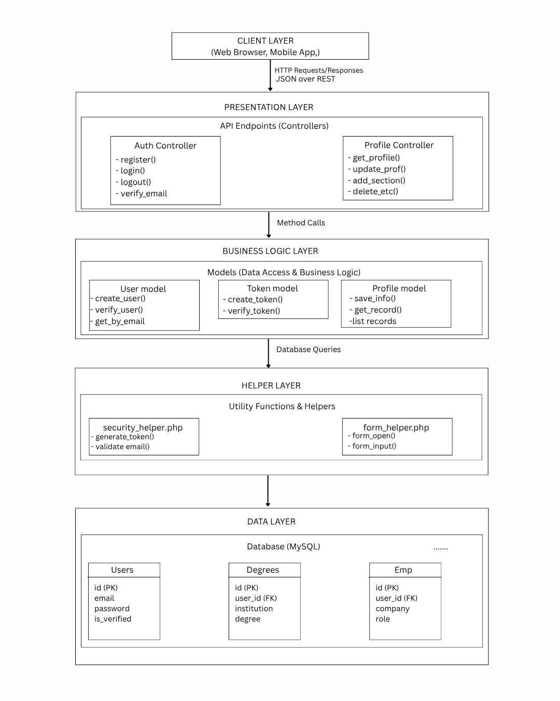

# Alumni Profile API - Architecture Design Documentation

## Overview

The Alumni Profile API is a RESTful web service built using CodeIgniter 3 (PHP) that manages alumni user profiles, authentication, and related data operations. The system implements a layered architecture pattern with MVC (Model-View-Controller) principles, emphasizing clean separation of concerns, maintainability, scalability, and security.

===================================================================
                                                                    
## Table of Contents

** **
                                                                    
1. [System Architecture Overview](#system-architecture-overview)    
2. [Layered Architecture](#layered-architecture)                                
3. [Design Patterns Architecture](#design-patterns-used)                                      
4. [Error Handling Architecture](#error-handling-architecture)      
5. [Security Architecture](#security-architecture)                  
                                                                    
====================================================================    

### Technology Stack

- *Framework*: CodeIgniter 3.1.13 (PHP 7.4+)
- *Database*: MySQL with foreign key constraints and indexing
- *Authentication*: Session based with secure token verification
- *Security*: bcrypt password hashing, CSRF protection, input sanitization
- *API Format*: RESTful JSON endpoints with consistent error handling

### System Components

- *Controllers*: Handle HTTP requests and responses (`Auth.php`, `Profile.php`)
- *Models*: Business logic and data operations (`User_model.php`,                `Profile_model.php`, `Token_model.php`)
- *Helpers*: Utility functions for security and validation (`security_helper.php`)
- *Database*: 10+ tables with referential integrity and cascading deletes

This documentation provides detailed insights into the system's architecture, design patterns, data flows, and implementation details.

---
                                            
***==========================================================***: 
## System Architecture Overview
***==========================================================***: 


# Architecture Diagram


path = (C:\xampp\htdocs\web_api\Documentation\images\Architecturre.png)




**Figure 1**: High-level architecture diagram showing the four-layer structure of the Alumni Profile API. The diagram illustrates how client requests flow through the Presentation Layer (Controllers), Business Logic Layer (Models), Utility Layer (Helpers), and Data Layer (Database), with clear separation of concerns and data flow directions.

The diagram depicts the complete request-response cycle starting from external clients making HTTP requests to the API endpoints. Controllers in the presentation layer act as the entry point, handling routing, input validation, and response formatting. Business logic is encapsulated in models that interact with the database through abstracted query operations, ensuring data integrity and security.

Utility functions and helpers provide cross-cutting concerns such as security token generation, email validation, and input sanitization. The database layer maintains persistent storage with proper indexing, foreign key relationships, and cascading operations to ensure referential integrity.

Arrows in the diagram show the directional flow of data and control, with authentication checks occurring at multiple layers to prevent unauthorized access. This layered approach enables maintainability, testability, and scalability while keeping each component focused on its specific responsibilities.


***==========================================================***: 
## Layered Architecture
***==========================================================***: 

The application follows a 4 layer architecture pattern:

### Layer 1: Presentation Layer (Controllers)

**Location**: `application/controllers/Api/`

**Components**:
- `Auth.php` - Authentication endpoints
- `Profile.php` - Profile management endpoints

**Key Characteristics**:
- Stateless request handlers
- Input validation and sanitization
- HTTP status code management
- JSON serialization/deserialization
- No direct database access (delegates to models)

**Request Flow**:
```
1. HTTP Request
2. Router
3. Controller Method
4. Validate
5. Business Logic
6. Response
```

### Layer 2: Business Logic Layer (Models)


**Location**: `application/models/`

**Components**:
- `User_model.php` - User account management
- `Profile_model.php` - Profile data management  
- `Token_model.php` - Authentication token handling
---


### Layer 3: Helper Layer (Utilities)
 

**Location**: `application/helpers/`

**Components**:
- `security_helper.php` - Cryptographic and validation utilities
- Framework helpers (form_helper, url_helper, etc.)

**Security Helper Functions**:
```
generate_secure_token()        = Cryptographically secure token generation
validate_university_email()    = Email domain whitelist validation
```

---

### Layer 4: Data Layer (Database)

**Location**: MySQl Database

**Components**:
- 10 tables with defined relationships
- Indexes for performance
- Cascading deletes for referential integrity

---

### Controllers (Presentation Layer)


#### Auth Controller

**File**: `application/controllers/Api/Auth.php`

**Single Responsibility**: Handle all authentication-related HTTP endpoints

**Public Methods**:

| Method  

!`register()`  
!`verify_email()` 
!`login()` 
!`logout()`
!`request_reset()` 
!`reset_password()`

**Protected Methods**:

| Method 

!`getJsonInput()` 

---

#### Profile Controller

**File**: `application/controllers/Api/Profile.php`

**Single Responsibility**: Handle all profile management HTTP endpoints

**Data Mapping Property**:
```php
private $sectionTables = [
    'degrees' => 'user_degrees',
    'certifications' => 'user_certifications',
    'licenses' => 'user_licenses',
    'short_courses' => 'user_short_courses',
    'employment_history' => 'user_employment_history',
];
```

**Public Methods**:

| Method 

| `get_profile()` 
| `update_profile()`
| `upload_profile_image()`
| `list_section($section)` 
| `add_section($section)`
| `update_section($section, $id)` 
| `delete_section($section, $id)` 
| `add_linkedin()` 
| `list_linkedin()` 
| `update_linkedin($id)` 
| `delete_linkedin($id)`

**Protected Methods**:

| Method 

| `getJsonInput()` 
| `require_auth()` 
| `is_valid_url()` 
| `is_valid_date()` s

---


### Models (Business Logic Layer)


#### User Model

**File**: `application/models/User_model.php`

**Single Responsibility**: Manage user account operations


**Public Methods**:

```php
create_user($email, $password)
  → Creates new user with hashed password
  → Used by: Auth::register()

get_by_email($email)
  → Retrieves user by email
  → Used by: Auth::login(), Auth::register()

verify_user($id)
  → Marks user email as verified
  → Used by: Auth::verify_email()
```

---

#### Token Model

**File**: `application/models/Token_model.php`

**Single Responsibility**: Manage verification and reset tokens

**Token Lifecycle**:
```
Generated → Stored → Sent to User → User clicks link → Validated → Used → Marked
  (64 chars)  (DB)    (via email)   (in URL param)  (checked)  (yes)  (used=1)
```

---

#### Profile Model

**File**: `application/models/Profile_model.php`

**Single Responsibility**: Manage all user profile data operations

**Generic CRUD Pattern**:
```php
// Create
public function create_record($table, $user_id, $data) {
    $data['user_id'] = $user_id;
    return $this->db->insert($table, $data);
}

// Read
public function list_records($table, $user_id) {
    return $this->db->get_where($table, ['user_id' => $user_id])->result();
}

// Update
public function update_record($table, $id, $user_id, $data) {
    $this->db->where('id', $id);
    $this->db->where('user_id', $user_id);
    return $this->db->update($table, $data);
}

// Delete
public function delete_record($table, $id, $user_id) {
    $this->db->where('id', $id);
    $this->db->where('user_id', $user_id);
    return $this->db->delete($table);
}
```
---

### Helpers (Utility Layer)

#### Security Helper

**File**: `application/helpers/security_helper.php`

**Single Responsibility**: Provide cryptographic and validation utilities

**Functions**:

```php
generate_secure_token()
  Purpose: Generate secure random token for email verification/password reset
  Implementation: random_bytes(32) → bin2hex()
  Returns: 64-character hexadecimal string (256 bits entropy)
  Usage: $token = generate_secure_token();

validate_university_email($email)
  Purpose: Validate email is from allowed university domain
  Implementation: Extract domain → Check against whitelist
  Returns: boolean (true if valid, false otherwise)
  Usage: if (!validate_university_email($email)) { error; }
```

**Security Considerations**:
- Tokens use cryptographically secure random source (random_bytes)
- Email validation prevents unauthorized domain registrations
- No sensitive data logging

---
***==========================================================***: 
## Design Patterns Used
***==========================================================***: 

### 1. Model-View-Controller (MVC)

**Implementation**:
- **View**: JSON responses (no HTML templates)
- **Controller**: Auth.php, Profile.php (request handlers)
- **Model**: User_model, Profile_model, Token_model (data layer)

**Benefits**:
- Separation of concerns
- Easy to test each component
- Clear responsibility boundaries

---

### 2. Generic CRUD Operations

**Implementation**: Profile_model provides generic methods for all profile sections

**Example**:
```php
// Instead of separate methods for each table:
public function create_record($table, $user_id, $data) {
    $data['user_id'] = $user_id;
    return $this->db->insert($table, $data);
}

// Use single method for all sections:
$this->Profile_model->create_record('user_degrees', $user_id, $data);
$this->Profile_model->create_record('user_certifications', $user_id, $data);
```

**Benefits**:
- Reduces code duplication
- Easier to maintain
- Consistent behavior across sections

---

### 5. Static Helper Functions

**Implementation**: Utility functions available globally

**Example**:
```php
// Helper function (stateless, pure)
function generate_secure_token() {
    return bin2hex(random_bytes(32));
}

// Usage in any controller/model
$token = generate_secure_token();
```


***==========================================================***: 
## Error Handling Architecture
***==========================================================***: 


The Alumni Profile API implements a comprehensive error handling strategy that ensures consistent, secure, and informative error responses across all endpoints. Error handling is implemented at multiple layers to provide appropriate feedback while preventing information leakage.

### Error Response Format

All API errors follow a consistent JSON structure to ensure predictable client handling:

```json
{
  "error": "Description of what went wrong"
}
```

**Error Response Standards**:
- Always returns JSON format
- Single "error" key with descriptive message
- No sensitive information exposed
- Appropriate HTTP status codes

### Error Handling in Controllers

Controllers implement error handling at the request processing level, validating inputs and managing HTTP responses appropriately.

```php
// Input validation → 400 error
if (!$email) {
    header('HTTP/1.1 400 Bad Request');
    echo json_encode(['error' => 'Email required']);
    return;
}

// Authentication check → 401 error
if (!$user_id) {
    header('HTTP/1.1 401 Unauthorized');
    echo json_encode(['error' => 'Authentication required']);
    exit;
}

// Record not found → 404 error
if (!$record) {
    header('HTTP/1.1 404 Not Found');
    echo json_encode(['error' => 'Item not found']);
    return;
}
```


### Error Handling Strategy

**Layered Error Handling**:
1. **Input Validation**: Check required fields, data types, formats
2. **Business Logic Validation**: Verify business rules and constraints
3. **Database Error Handling**: Manage connection issues, constraint violations
4. **Security Validation**: Prevent unauthorized access, validate tokens


***==========================================================***: 
## Security Architecture
***==========================================================***: 


The Alumni Profile API implements a comprehensive security architecture with multiple layers of protection to ensure data confidentiality, integrity, and availability.

### Authentication & Authorization

**Session-Based Authentication**:
- Server-side session storage with configurable timeout (1800 seconds)
- Session ID transmitted via secure HTTP-only cookies
- User verification required for email-verified accounts only
- Automatic session cleanup on logout

**Password Security**:
- bcrypt hashing with cost factor 10 for password storage
- Minimum 8-character passwords with complexity requirements:
  - At least one uppercase letter
  - At least one lowercase letter
  - At least one number
  - At least one special character
- Secure password verification using `password_verify()`

**Token-Based Verification**:
- Cryptographically secure token generation (256-bit entropy)
- Email verification tokens with 24-hour expiration
- Password reset tokens with 1-hour expiration
- One-time use tokens to prevent replay attacks

### Input Validation & Sanitization

**Request Validation**:
- JSON input parsing with fallback to form data
- Email domain whitelist validation (university.edu, alumni.university.edu)
- URL and date format validation
- Required field validation with appropriate error responses

### Data Protection

**Database Security**:
- Foreign key constraints with cascading deletes
- Indexed columns for performance and integrity
- No sensitive data logging
- Parameterized queries prevent SQL injection

**API Security**:
- RESTful endpoint design
- Consistent error response format (no information leakage)
- HTTP status codes for different error types
- CSRF protection through session validation

### Security Helper Functions

**Core Security Utilities**:
```php
generate_secure_token()
  - 64-character hex token from random_bytes(32)
  - Used for email verification and password reset

validate_university_email($email)
  - Domain whitelist validation
  - Prevents unauthorized registrations
```

### Security Best Practices Implemented

. Password complexity requirements
. Secure password hashing (bcrypt)
. Session management
. Input validation
. SQL injection prevention
. XSS protection
. Secure token generation
. Email verification workflow
. Error message sanitization
. Database constraints

This security architecture provides a solid foundation while remaining extensible for additional security measures as the system grows.

This deliberate architectural design ensures long-term maintainability and supports future growth of the platform.
