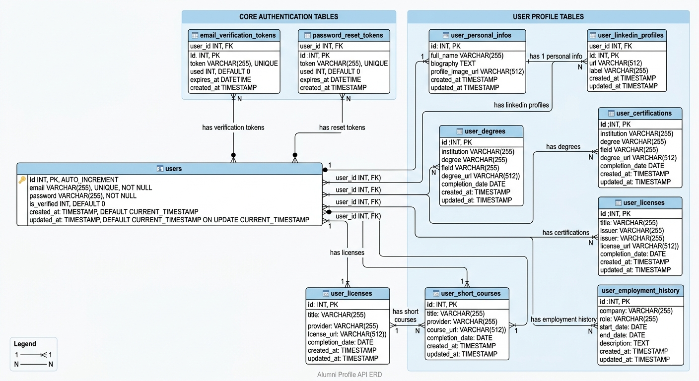

# Alumni Profile API - Database Schema Documentation

## Overview

The Alumni Profile API database is built on a relational model designed to manage user authentication and comprehensive profile information. The schema enforces data integrity through foreign key relationships and maintains temporal tracking with created_at and updated_at timestamps.

**Database Name**: `alumni_db`

**Database Type**: MySQL
---

## Table of Contents

1. [Core Authentication Tables](#core-authentication-tables)
2. [User Profile Tables](#user-profile-tables)
3. [Relationships & Constraints](#relationships--constraints)
4. [Entity-Relationship Diagram](#entity-relationship-diagram)

---

## Core Authentication Tables

### 1. users Table

Stores core user account information and authentication credentials.

**Primary Key**: id

**Constraints**:
- PRIMARY KEY (id)
- UNIQUE KEY (email)
- CHECK: is_verified IN (0, 1)

**Indexes**:
- Primary key index on id (AUTO_INCREMENT)
- Unique index on email (speeds up lookups during login/registration)

---

### 2. email_verification_tokens Table

Stores email verification tokens for newly registered users.

**Primary Key**: `id`

**Foreign Key**: `user_id` = users.id (ON DELETE CASCADE)

**Constraints**:
- PRIMARY KEY (id)
- FOREIGN KEY (user_id) REFERENCES users(id) ON DELETE CASCADE
- UNIQUE KEY (token)
- CHECK: used IN (0, 1)

**Indexes**:
- Primary key on id
- Foreign key on user_id
- Unique index on token (fast lookup during verification)

**Token Generation Algorithm**:
- Source: random_bytes(32) - 256 bits of entropy
- Format: bin2hex() - 64-character hexadecimal string
- Expiration: NOW() + INTERVAL 24 HOURS
- One-time use: can only be used when used=0

**Sample Data**:
```sql
INSERT INTO email_verification_tokens 
  (user_id, token, used, expires_at) VALUES
(3, 'sample_verification_token_1234567890abcdef', 0, DATE_ADD(NOW(), INTERVAL 24 HOUR));
```

---

### 3. `password_reset_tokens` Table

Stores password reset tokens for account recovery.

**Primary Key**: `id`

**Foreign Key**: `user_id` → users.id (ON DELETE CASCADE)

**Constraints**:
- PRIMARY KEY (id)
- FOREIGN KEY (user_id) REFERENCES users(id) ON DELETE CASCADE
- UNIQUE KEY (token)
- CHECK: used IN (0, 1)

**Indexes**:
- Primary key on id
- Foreign key on user_id
- Unique index on token (fast lookup during reset)

**Token Details**:
- Source: random_bytes(32) - 256 bits of entropy
- Format: bin2hex() - 64-character hexadecimal string
- Expiration: NOW() + INTERVAL 1 HOUR (shorter than email verification for security)
- One-time use: marked as used=1 after successful password reset

**Sample Data**:
```sql
INSERT INTO password_reset_tokens 
  (user_id, token, used, expires_at) VALUES
(1, 'sample_reset_token_abcdef1234567890', 0, DATE_ADD(NOW(), INTERVAL 1 HOUR));
```

---

## User Profile Tables

### 4. `user_personal_infos` Table

Stores basic personal profile information for each user.

**Primary Key**: `id`

**Foreign Key**: `user_id` → users.id (ON DELETE CASCADE)

**Constraints**:
- PRIMARY KEY (id)
- FOREIGN KEY (user_id) REFERENCES users(id) ON DELETE CASCADE
- UNIQUE KEY (user_id) - one personal info record per user

**Indexes**:
- Primary key on id
- Foreign key index on user_id (for lookups)
- Unique index on user_id (ensures 1:1 relationship)

**Profile Image Storage**:
- Images stored in: `/uploads/profile_images/`
- Filenames encrypted to prevent enumeration
- Max size: 2 MB
- Allowed types: gif, jpg, jpeg, png
- URL stored as absolute path for easy access

**Sample Data**:
```sql
INSERT INTO user_personal_infos 
  (user_id, full_name, biography, profile_image_url) VALUES
(1, 'John Michael Doe', 'Software engineer with 5+ years experience', 
 'http://localhost/alumni/uploads/profile_images/abc123def456.jpg');
```

---

### 5. `user_linkedin_profiles` Table

Stores multiple LinkedIn profile URLs for each user.

**Primary Key**: `id`

**Foreign Key**: `user_id` → users.id (ON DELETE CASCADE)

**Constraints**:
- PRIMARY KEY (id)
- FOREIGN KEY (user_id) REFERENCES users(id) ON DELETE CASCADE
- NOT NULL: url (must provide LinkedIn URL)

**Indexes**:
- Primary key on id
- Foreign key index on user_id (for user's profiles lookups)

**URL Validation**:
- Validated with filter_var(FILTER_VALIDATE_URL)
- Must include http:// or https://
- Examples: https://linkedin.com/in/thanuja, https://linkedin.com/company/acme

**Sample Data**:
```sql
INSERT INTO user_linkedin_profiles 
  (user_id, url, label) VALUES
(1, 'https://linkedin.com/in/johndoe', 'Personal LinkedIn'),
(1, 'https://linkedin.com/company/acme-corp', 'Company Page');
```

---

### 6. `user_degrees` Table

Stores educational degrees earned by users.

**Primary Key**: `id`

**Foreign Key**: `user_id` = users.id (ON DELETE CASCADE)

**Constraints**:
- PRIMARY KEY (id)
- FOREIGN KEY (user_id) REFERENCES users(id) ON DELETE CASCADE
- NOT NULL: institution, degree

**Indexes**:
- Primary key on id
- Foreign key index on user_id (for user's degrees lookup)

**URL Validation**:
- degree_url validated with filter_var(FILTER_VALIDATE_URL)
- Must include http:// or https://

**Date Format**:
- ISO 8601 format: YYYY-MM-DD
- Examples: 2020-05-30, 2023-12-15

**Sample Data**:
```sql
INSERT INTO user_degrees 
  (user_id, institution, degree, field, degree_url, completion_date) VALUES
(1, 'University of Technology', 'Bachelor of Science', 'Computer Science', 
 'https://example.com/verify/degree123', '2020-05-30');
```

---

### 7. `user_certifications` Table

Stores professional certifications obtained by users.

**Primary Key**: `id`

**Foreign Key**: `user_id` = users.id (ON DELETE CASCADE)

**Constraints**:
- PRIMARY KEY (id)
- FOREIGN KEY (user_id) REFERENCES users(id) ON DELETE CASCADE
- NOT NULL: title

**Indexes**:
- Primary key on id
- Foreign key index on user_id

**Supported Certifications Examples**:
- AWS Certified Solutions Architect
- Google Cloud Professional Data Engineer
- Microsoft Azure Administrator
- Oracle Database Administrator
- Kubernetes (CKAD)

**Sample Data**:
```sql
INSERT INTO user_certifications 
  (user_id, title, provider, cert_url, completion_date) VALUES
(1, 'AWS Solutions Architect - Professional', 'Amazon Web Services', 
 'https://aws.amazon.com/verification/abc123', '2023-06-15');
```

---

### 8. `user_licenses` Table

Stores professional licenses held by users.

**Primary Key**: `id`

**Foreign Key**: `user_id` → users.id (ON DELETE CASCADE)

**Constraints**:
- PRIMARY KEY (id)
- FOREIGN KEY (user_id) REFERENCES users(id) ON DELETE CASCADE
- NOT NULL: title

**Indexes**:
- Primary key on id
- Foreign key index on user_id

**Supported License Types**:
- Professional Engineer (PE)
- Licensed Architect (RA/AIA)
- Certified Public Accountant (CPA)
- Registered Nurse (RN)
- State-specific licenses

**Sample Data**:
```sql
INSERT INTO user_licenses 
  (user_id, title, issuer, license_url, completion_date) VALUES
(1, 'Professional Engineer - Software', 'State Board of Professional Engineers', 
 'https://verify.state.gov/license/PE123456', '2021-03-20');
```

---

### 9. `user_short_courses` Table

Stores short-term training courses and skill development programs.

**Primary Key**: `id`

**Foreign Key**: `user_id` → users.id (ON DELETE CASCADE)

**Constraints**:
- PRIMARY KEY (id)
- FOREIGN KEY (user_id) REFERENCES users(id) ON DELETE CASCADE
- NOT NULL: title

**Indexes**:
- Primary key on id
- Foreign key index on user_id

**Course Providers**:
- Coursera, Udacity, edX
- LinkedIn Learning, Pluralsight
- Datacamp, Codecademy
- Internal company training

**Sample Data**:
```sql
INSERT INTO user_short_courses 
  (user_id, title, provider, course_url, completion_date) VALUES
(1, 'Advanced Python Programming', 'Coursera', 
 'https://coursera.org/verify/abc123def456', '2023-09-10');
```

---

### 10. `user_employment_history` Table

Stores employment history and work experience records.

**Primary Key**: `id`

**Foreign Key**: `user_id` → users.id (ON DELETE CASCADE)

**Constraints**:
- PRIMARY KEY (id)
- FOREIGN KEY (user_id) REFERENCES users(id) ON DELETE CASCADE
- NOT NULL: company, role, start_date
- CHECK: end_date >= start_date OR end_date IS NULL (date logic validation)

**Indexes**:
- Primary key on id
- Foreign key index on user_id
- Composite index on (user_id, start_date DESC) for timeline queries

**Current Employment Indicator**:
- end_date = NULL indicates currently employed
- end_date populated with date indicates past employment

**Date Format**:
- ISO 8601 format: YYYY-MM-DD
- start_date must be <= end_date (if end_date provided)

**Sample Data**:
```sql
INSERT INTO user_employment_history 
  (user_id, company, role, start_date, end_date, description) VALUES
(1, 'Tech Company Inc', 'Senior Software Engineer', '2020-06-01', NULL, 
 'Led development of core platform features. Mentored 5 junior developers.'),
(1, 'Startup LLC', 'Full Stack Developer', '2018-01-15', '2020-05-31', 
 'Built and maintained web applications using React and Node.js');
```

---

## Relationships & Constraints

### Entity-Relationship Diagram

```


path = (C:\xampp\htdocs\web_api\Documentation\images\Relationship_diagram.png) 




```

### Foreign Key Relationships

All tables with user_id reference the users table with CASCADE DELETE:

```sql
CONSTRAINT fk_user_id 
  FOREIGN KEY (user_id) 
  REFERENCES users(id) 
  ON DELETE CASCADE
```

**Cascade Delete Behavior**:
- When user deleted from users table
- All related profile records automatically deleted
- Ensures referential integrity
- Prevents orphaned records

---


